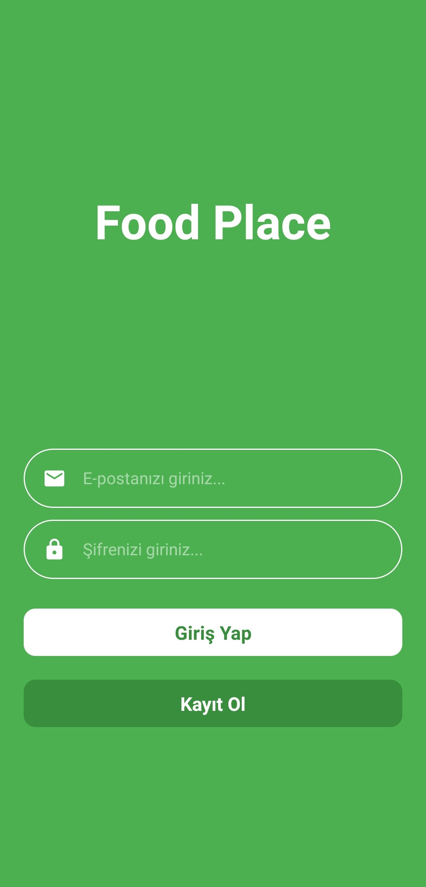
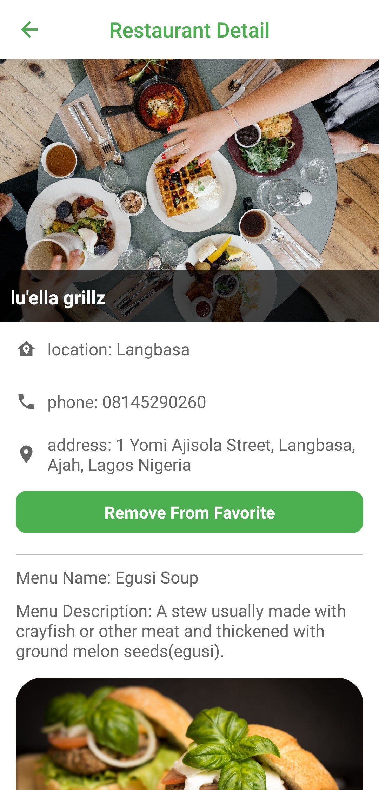

# Food Place App
This application allows users to register and log in later to see food places and their menus. The user can add his favorite food places to his favourites.

## Used technologies
- React Native
- Firebase Authentication
- Firebase Realtime Database
- React Native Navigation
- React Native Vector Icons
- Formik
- Yup

## Screens
<p>

</p>
<p>

</p>
<p>
</p>

## Screen Recording


## Installation
1.Clone Project
```
git clone https://github.com/furkanbagirgan/Foodplace-App.git
```
2.Install the Necessary Packages for Project
```
npm install
```
3.Run Project To Emulator or Real Device
```
npx react-native start & npx react-native run-android
```
